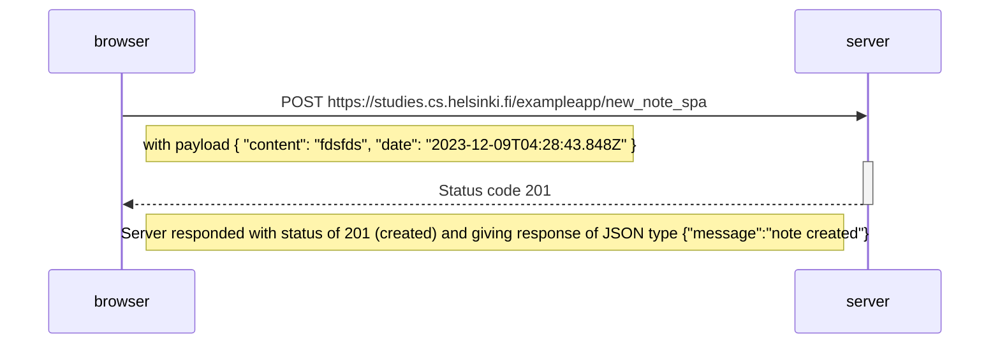

### Sequence Diagram: User interact with save buton in /spa 

[source](https://studies.cs.helsinki.fi/exampleapp/spa)

Below is a sequence diagram illustrating the interaction between browser and server when user submiting the entries in /spa ExampleApp:

